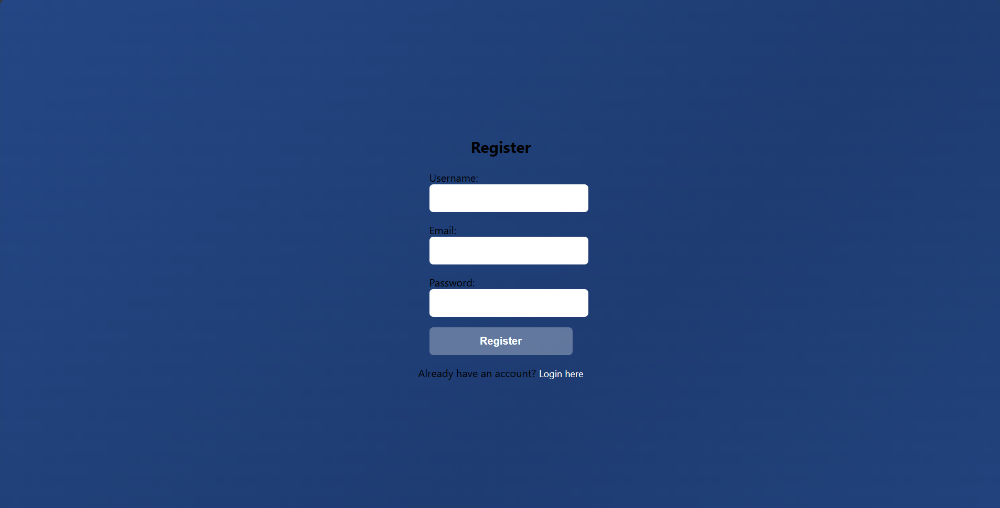

<<<<<<< HEAD
# Auth App T2

A simple PHP authentication application featuring user registration, login, and protected dashboard functionality. This project is ideal for learning and quick prototyping of web authentication using PHP and MySQL.

---

## 🚀 Project Setup

1. **Clone the repository**
    ```bash
    git clone https://github.com/Ali-Amir-code/auth_app_t2.git
    cd auth_app_t2
    ```

2. **Configure the Database**
    - Create a database named `auth_db` in MySQL (e.g., via XAMPP or phpMyAdmin).
    - Create a table named `users`:
      ```sql
      CREATE TABLE users (
        id INT AUTO_INCREMENT PRIMARY KEY,
        username VARCHAR(255) NOT NULL,
        email VARCHAR(255) NOT NULL UNIQUE,
        password VARCHAR(255) NOT NULL
      );
      ```
    - Update `config/db.php` if you use different DB credentials.

3. **Run the Application**
    - Place the project in your web server directory (e.g., `htdocs` for XAMPP).
    - Navigate to `http://localhost/auth_app_t2/index.php` in your browser.

---

## 🗂️ Project Structure

```
auth_app_t2/
├── config/
│   └── db.php           # Database connection
├── includes/
│   └── functions.php    # Utility functions (e.g., sanitization, login checks)
├── public/
│   ├── css/
│   │   └── styles.css   # Frontend styles
│   ├── dashboard.php    # Protected dashboard (after login)
│   ├── logout.php       # Logout handler
│   └── register.php     # User registration page
├── index.php            # Login page & entry point
```

---

## 🛠️ Implementation Overview

### **Authentication Flow**
- **Registration:**  
  - Users sign up via `public/register.php`.  
  - Input is sanitized, email uniqueness is checked, and passwords are hashed before storing in the database.

- **Login:**  
  - Users log in via `index.php`.
  - Credentials are validated; password verification uses PHP’s `password_verify()`.

- **Session Management:**  
  - Upon successful login, PHP sessions store user ID and username.
  - Protected routes like `public/dashboard.php` use session checks (`ensure_logged_in()`).

- **Logout:**  
  - `public/logout.php` destroys the session and redirects to login.

### **Code Details**
- **Database Connection** (`config/db.php`):  
  Uses MySQLi to connect to a local database. Error handling for connection issues is implemented.
- **Utility Functions** (`includes/functions.php`):  
  - `sanitize()`: For safe input handling.
  - `redirect()`: For navigation.
  - `is_logged_in()` & `ensure_logged_in()`: For session-based access control.
- **Frontend** (`public/css/styles.css`):  
  - Modern gradient background and card layout.
  - Responsive forms for login and registration.

---

## 📝 Additional Notes

- **Security:**  
  - Inputs are sanitized; passwords are hashed.
  - Email uniqueness is enforced during registration.
- **Customization:**  
  - You can expand the dashboard, add password reset, or introduce email verification as needed.
- **Stack:**  
  - PHP, MySQL, HTML/CSS.

---

## 📬 Contact

For questions or feedback, open an issue on GitHub.

---

## Demo


## Login Page


## Register Page


## Dashboard Page

